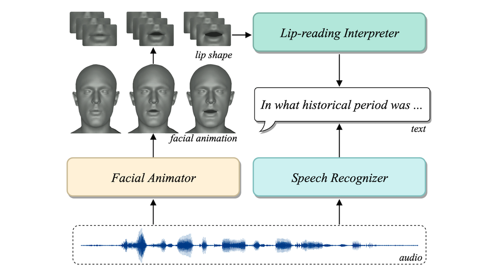

# SelfTalk
The official repository of the paper [SelfTalk: A Self-Supervised Commutative Training Diagram to Comprehend 3D Talking Faces](https://arxiv.org/abs/2306.10799)

  <b>
    <a href="https://arxiv.org/abs/2306.10799">Paper</a>
    | 
    <a href="https://ziqiaopeng.github.io/selftalk/">Video</a>
    |
    <a href="https://github.com/ZiqiaoPeng/SelfTalk">Code</a> 
  </b>

 

  
  
    
  

  The proposed **SelfTalk** utilizes a cross-modal network system to generate coherent and visually comprehensible 3D talking faces by reducing the domain gap between different modalities.

  ## Code

We are organizing our code and will release it soon.